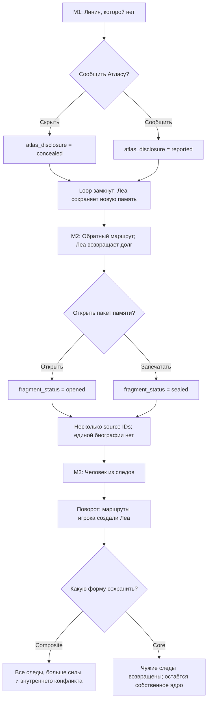

# R02 — story-first narrative proof

**Версия:** 0.1
**Дата решения:** 16 июля 2026 года
**Статус:** текущий R02 decision memo; narrative foundation реализована, R02 целиком остаётся `IN_PROGRESS`

## Решение

До универсального Wizard-of-Oz generator проект сначала фиксирует сильный
авторский позвоночник. Откладывается не сюжетный граф, а production graph
engine.

Последовательность R02:

```text
R02A: мир → трёхмиссионный граф → states → setup/payoff → M1 beats
  ↓
R02B: ручная привязка M1 к текущему городу → A/B cue sheets → temp audio → founder dry run
  ↓
R02C: исправления → parity lock → participant package для R03
```

Полностью производится пока только M1. M2–M3 существуют как дешёвый граф,
чтобы у первой миссии были честные setup, payoff и причина вернуться.

## Географическая модель

Два контекста намеренно разделены:

- **Product behavior — home-territory-based.** У пользователя одна активная
  домашняя территория, знакомые места возвращаются и накапливают сюжетное
  значение. Путешествие не является фичей.
- **Founder research — traveler-based.** Текущий город основателя является
  сменным полевым fixture для ручной привязки одной канонической миссии.
  Город не входит в story state и не требует cross-city mechanics.

Бар остаётся frozen R01 fixture, показавшим наличие POI-кандидатов. Он не
ограничивает R02 и не доказывает качество маршрутов: в репозитории сохранены
результаты POI-аудита, но нет заявленных R01 GPX/cache/manual-route-QA assets.
Поэтому каждый реальный маршрут R02 заново проверяется человеком.

Точные координаты, публичная стартовая точка, GPX и raw trace хранятся только в
игнорируемом `research/r02/local/`. В канон и committed fixtures они не попадают.

## Выбранная вселенная: «Нулевой слой»

Три кандидата были сравнены по единой стобалльной рубрике. Это редакционное
решение модели, а не пользовательское доказательство.

| Кандидат | Балл | Главная сила | Главный риск |
|---|---:|---|---|
| Dracula-inspired «Кровь города» | 77 | звук, погоня, ясные ставки | знакомые ходы, историко-ночная зависимость, слабее собственный IP |
| «Нулевая частота» | 87 | мгновенный high-concept и поворот | временная/модельная логика усложняет сезон; POI могут стать ретрансляторами |
| **«Нулевой слой»** | **93** | движение, город, персонаж и поворот — одна причинная система | метафора станет холодной, если отношения уступят место лору |

Стратегический tie-break:

> В «Нулевом слое» нельзя убрать маршрут, не разрушив рождение главного
> персонажа. Это наиболее сильное соединение истории с продуктовым ядром.

Логлайн:

> **Ты думаешь, что пробежками спасаешь девушку из стёртой карты. Потом
> узнаёшь: до твоего первого маршрута её не существовало.**

### Мир

Под официальной картой существует Нулевой слой — отброшенные маршруты,
недостоверные совпадения и человеческие следы, которые архивная система
исключила ради надёжности.

- плановые беговые интервалы проводят линию через белый разрыв;
- ходьба стабилизирует линию и открывает разговор;
- замыкание безопасного loop сохраняет нарисованный фрагмент;
- повторный визит раскрывает новый след или последствие;
- ускорение сверх workout никогда не требуется;
- безопасный отказ, остановка или geo fallback никого не убивают.

### Леа

Леа считает себя картографом, застрявшим в белом пятне. Она компетентна, сухо
смешна, боится распасться на чужие голоса и скрывает несовместимые провалы
памяти. Сначала игрок помогает ей, но уже в M2 она выполняет обещание и
существенно помогает игроку в ответ.

Центральный поворот:

> Игрок не спасал заранее существовавшую Леа. Завершённые маршруты связали
> чужие отброшенные следы и создали новую личность.

Поворот подготовлен четырьмя деталями:

1. Леа помнит один witness с двух несовместимых ракурсов.
2. после M1 Атлас сообщает о 214 восстановленных фрагментах следа;
3. в M2 voiceprint Леа на миг показывает несколько source IDs;
4. в реестре нет человека с её полной биографией.

После раскрытия вопрос меняется с «настоящая ли история Леа?» на «что теперь
принадлежит новой личности и кто имеет право решить её форму?».

## Голосовой safety contract

Даже если оба системных слоя временно озвучиваются одним TTS, роли различаются
звуковыми префиксами:

- `NAV` — фактическая навигация, workout и safety; всегда правдив, имеет
  абсолютный аудиоприоритет;
- `ATLAS` — diegetic архивная политика; может быть неполным или морально
  спорным, но не переопределяет NAV;
- `LEA` — актёрский голос истории; никогда не просит игнорировать NAV,
  ускоряться или сходить с approved route.

Порядок аудио:

```text
NAV maneuver > workout transition > safety > story > ambience
```

## Трёхмиссионный граф



Граф имеет один общий backbone, три решения, последующее чтение первых двух
решений и восемь достижимых путей. Обе M3-концовки сохраняют Леа и открывают
следующий акт; это две эмоционально разные формы последствий, а не восемь
отдельных сезонов.

Machine-readable source:
[narrative_graph.v0.1.json](../research/r02/narrative_graph.v0.1.json).

## Первая миссия

M1 называется **«Линия, которой нет»**.

Структура:

1. штатный NAV и едва слышимый чужой голос;
2. cold open за 30 секунд до первого run-интервала;
3. `threshold` доказывает, что движение дорисовывает линию;
4. `witness` даёт общую географию и первую трещину в памяти Леа;
5. игрок сообщает Атласу о голосе или скрывает его;
6. `triangulation` связывает третий тип пространства с личным образом дома;
7. loop closure сохраняет первую собственную фразу Леа;
8. Атлас сообщает о 214 фрагментах;
9. Леа обещает провести игрока в M2.

У M1 три geo slots и два time/state beats. Это разрешает прежнюю коллизию
спецификаций: **2–3 реальных места + временные/сюжетные beats = 4–5
драматургических функций**.

Полный первый draft с workout windows, A/B-текстом и fallbacks:
[mission_01_beats.v0.1.json](../research/r02/mission_01_beats.v0.1.json).

## A/B contract

Для одной и той же тренировки и одного маршрута:

- **A:** реальный объект назван или наблюдаем и причинно выполняет функцию
  сцены;
- **B:** тот же beat приходит через внутренний сигнал; текст не направляет
  внимание на окружающий объект и не использует его свойства.

Фраза «посмотри на это здание» не является честным control: она всё ещё
использует окружение. Неизменными остаются plot, choices, outcome, workout,
порядок сцен, голоса, музыка, навигация и приблизительная длина текста.

## Реализованный authoring process

`tools/r02_story.py` использует только Python standard library и умеет:

```bash
python3 tools/r02_story.py validate
python3 tools/r02_story.py paths
python3 tools/r02_story.py linearize --mission m01 --condition B
```

Проверяются:

- уникальные node/edge/state IDs;
- dangling и unreachable nodes;
- циклы и тупики;
- choice fallback;
- типы state reads/writes;
- максимум восемь путей;
- причинное действие бегуна в каждой миссии;
- authored fallback каждого geo slot;
- минимум две setups и их поздний payoff;
- отсутствие города исследования в каноне;
- A/B place-placeholder и word-count parity;
- 30-минутная целостность workout fixture;
- запрет participant export без human approvals;
- отсутствие точных координат и raw trace в committed binding.

## Что доказано и не доказано

Доказано текущими артефактами:

- граф структурно связен и имеет восемь валидных путей;
- решения M1 и M2 действительно читаются позже;
- центральный поворот имеет setup/payoff ledger;
- M1 может быть детерминированно линеаризована в A/B cue draft;
- participant export заблокирован до ручного approval.

Не доказано:

- что Леа вызывает привязанность;
- что поворот неожидан для человека, не видевшего граф;
- что темп текста работает во время реальной нагрузки;
- что geo-сцены ощущаются необходимыми;
- что пользователь фактически выйдет на M2;
- что знакомая домашняя территория выдержит шесть миссий.

Founder self-test полезен для темпа, внимания, телесной причинности, safety и
operability. Он не проверяет неожиданность поворота, потому что основатель знает
граф. Позже cold open нужен минимум 5–8 слепым слушателям; это не требует найма
писателей.

## Единственный следующий шаг

Собрать и пройти **M1-A в текущем городе основателя**:

1. скопировать `fixtures/field_binding.example.json` в
   `research/r02/local/current.binding.json`;
2. выбрать публичный старт и вручную пройти безопасный loop;
3. назначить `threshold`, `witness`, `triangulation`;
4. подтвердить видимость, подход, покрытие, манёвры, рельеф и fallbacks;
5. установить approvals только после проверки;
6. линеаризовать participant cue sheet;
7. собрать временное аудио `NAV / ATLAS / LEA`;
8. пройти founder dry run без импровизации оператора;
9. сразу заполнить field-run форму и повторить recall через 24 часа.

Команда после реального approval:

```bash
python3 tools/r02_story.py linearize \
  --mission m01 \
  --condition A \
  --binding research/r02/local/current.binding.json \
  --participant
```

До route binding, audio и dry run этап R02 не может быть `COMPLETE`.
